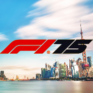

# 🏎️ Calendario Fórmula 1 2025

¡Bienvenido! Este proyecto es una **aplicación web interactiva** para consultar el calendario, resultados, podios, detalles de circuitos y pronóstico del tiempo de la temporada 2025 de Fórmula 1.

---

## 🚀 Instalación y uso

### 📦 Requisitos
- Tener instalado [XAMPP](https://www.apachefriends.org/es/index.html) o cualquier servidor local compatible con PHP/HTML/JS.
- Navegador web moderno (Chrome, Firefox, Edge, etc).

### 📝 Pasos para instalar y ejecutar la web

1. **Descarga o clona este repositorio:**
   ```sh
   git clone https://github.com/scorpio21/calendario_F1.git
   ```
2. **Copia la carpeta del proyecto** a la ruta de tu servidor local, por ejemplo:
   - Para XAMPP: `C:/xampp/htdocs/calendarios/calendario-F1-2025`
3. **Inicia el servidor Apache** desde el panel de control de XAMPP.
4. **Abre tu navegador** y accede a:
   ```
   http://localhost/calendarios/calendario-F1-2025/
   ```

¡Listo! Ya puedes navegar por el calendario, resultados, podios y más.

---

## ⚙️ Uso avanzado: actualización automática de datos con Node.js/npm

Si quieres usar los scripts de scraping para actualizar los datos de carreras, pilotos, equipos, etc. automáticamente, sigue estos pasos:

### 1. Instala Node.js
- Descárgalo desde [nodejs.org](https://nodejs.org/) e instálalo en tu sistema.

### 2. Instala las dependencias del proyecto
Desde la carpeta raíz del proyecto, ejecuta:

```sh
npm install
```
Esto creará la carpeta `node_modules` y descargará las librerías necesarias (`axios`, `cheerio`, `puppeteer`).

### 3. Ejecuta los scripts de scraping
En la carpeta `scraper/` tienes varios scripts para actualizar los datos. Algunos ejemplos:

- **Actualizar todos los datos principales:**
  ```sh
  npm run scrape
  ```
- **Actualizar pilotos:**
  ```sh
  npm run scrape:drivers
  ```
- **Actualizar equipos:**
  ```sh
  npm run scrape:teams
  ```
- **Actualizar carreras:**
  ```sh
  npm run scrape:races
  ```

Puedes editar o crear tus propios scripts en la carpeta `scraper/` según tus necesidades.

---


## ✨ Características principales

- 📅 **Calendario completo** de carreras con fechas, circuitos y vueltas.
- 🏆 **Visualización del podio** de cada carrera, con imágenes y equipos de los pilotos.
- ⏳ **Cuenta regresiva** dinámica hasta la próxima carrera.
- 🗺️ **Mapa interactivo** de circuitos con ubicación geográfica.
- 🌦️ **Pronóstico del tiempo** para la próxima carrera.
- 🗂️ **Pestañas** para navegar entre calendario, resultados, clasificación y detalles.

---

## 📁 Estructura del proyecto

```
calendario-F1-2025/
├── index.html                # Página principal
├── js/                       # Scripts principales
│   ├── races-data.js         # Datos de carreras y podios
│   ├── script.js, main.js    # Lógica de la app
│   └── map.js                # Mapa de circuitos
├── css/                      # Hojas de estilo
├── img/
│   └── pilotos/              # Imágenes de pilotos
├── scraper/                  # Scripts para actualizar datos
└── README.md                 # Este archivo
```

---

## 🛠️ ¿Cómo actualizar los datos?

1. **Edita `js/races-data.js`**
   - Cada carrera es un objeto con fecha, circuito, estado, ganador y podio.
   - El podio debe tener los campos `name`, `team` e `image` (sin `.jpg`).
   - Si falta algún dato, usa un valor genérico (`placeholder`).
2. **Imágenes de pilotos**
   - Guarda las imágenes en `img/pilotos/`.
   - El campo `image` debe coincidir con el nombre del archivo (sin extensión).
   - Si no tienes imagen, usa el slug `placeholder` para evitar errores visuales.

---

## ⏱️ Funcionamiento del contador y próxima carrera

- El sistema detecta automáticamente la próxima carrera según la fecha y el estado en los datos.
- El contador se actualiza cada segundo y la interfaz solo se refresca cuando hay un cambio real, evitando recargas y mensajes repetidos en consola.
- Si la próxima carrera no es la correcta, revisa los estados y fechas en `races-data.js`.

---

## ✅ Buenas prácticas

- Mantén los datos de podio completos para cada carrera finalizada.
- Usa clases CSS para mostrar/ocultar pestañas, evitando estilos inline.
- Si agregas nuevas carreras o pilotos, añade sus imágenes y datos correspondientes.
- Revisa la consola para detectar advertencias o errores y mantener la app limpia.

---

## 👨‍💻 Créditos y contacto

Desarrollado por **[Scorpio](https://github.com/Scorpio1992)**

¿Dudas, sugerencias o errores? ¡Abre un issue o contacta al desarrollador!

---

<p align="center">
  
</p>
